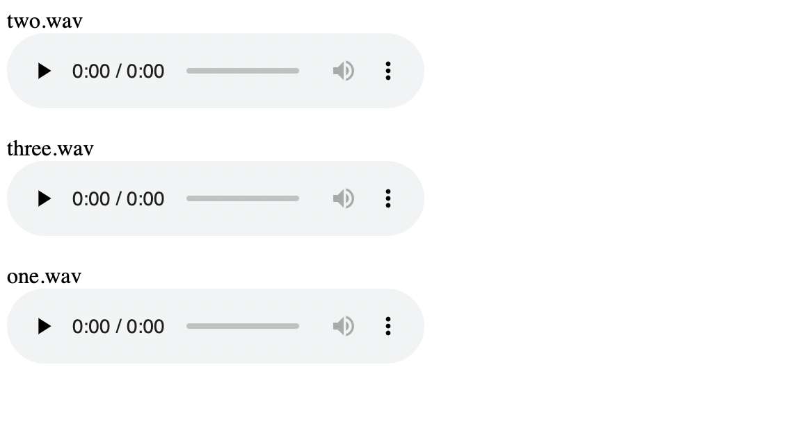

# sss

This is a static web server that specializes in checking a lot of audio files that are placed on remote server.
It's designed to be used with SSH tunneling.

## Screenshot



## Usage

```
USAGE:
    sss [OPTIONS] [TARGET_DIR]

FLAGS:
    -h, --help       Prints help information
    -V, --version    Prints version information

OPTIONS:
    -b, --bind-address <bind-address>     [default: localhost]
    -p, --port <port>                     [default: 8000]
```

```
sss ./sample
```

```
sss --port 8000 --bind-address localhost sample
```